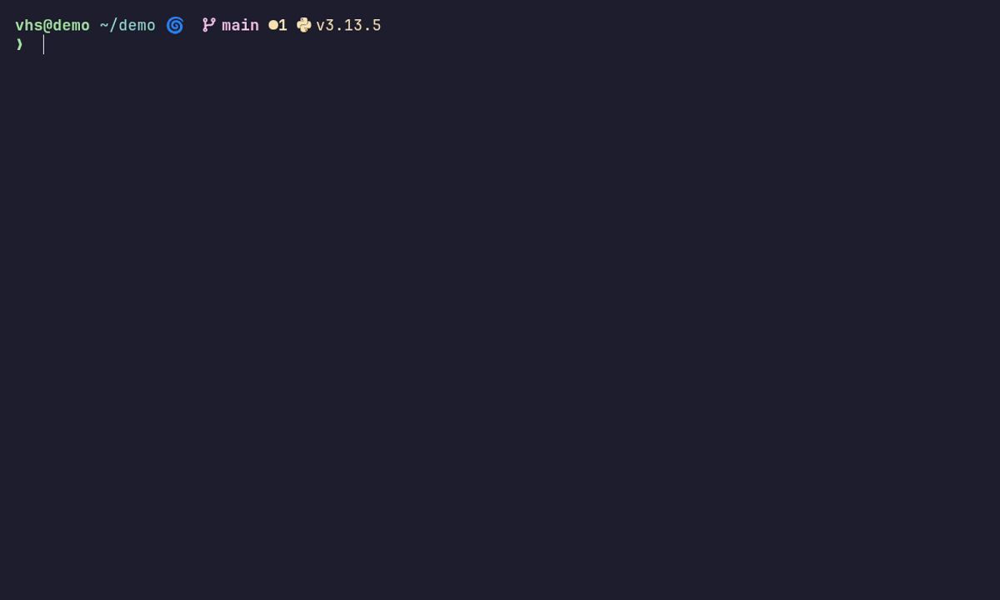

# zsh

Powerful but tastefully minimal zsh configuration.



> The demo above is generated automatically with [VHS](https://github.com/charmbracelet/vhs).
> Regenerate it with `demo/record.sh` (requires Docker); CI refreshes it when the tape or config changes.

## Dependencies

### Arch

```sh
paru -S zsh neovim eza bat fd fzf zoxide starship ripgrep lf
```

### Ubuntu

```sh
sudo apt install zsh neovim eza bat fd-find fzf ripgrep
# install zoxide and starship separately
curl -sSfL https://raw.githubusercontent.com/ajeetdsouza/zoxide/main/install.sh | sh
curl -sS https://starship.rs/install.sh | sh
# Ubuntu installs bat and fd under different names, symlink them so everything works
ln -s $(which batcat) ~/.local/bin/bat
ln -s $(which fdfind) ~/.local/bin/fd
# lf is not packaged in apt; grab the latest release binary (use lf-linux-arm64 on ARM)
curl -fsSL https://github.com/gokcehan/lf/releases/latest/download/lf-linux-amd64.tar.gz | tar xz -C ~/.local/bin lf
```

### macOS

```sh
brew install zsh neovim eza bat fd fzf zoxide starship ripgrep lf
```

## Setup

**1. Clone the repo**

```sh
git clone https://github.com/alexeigor/zsh ~/.config/zsh
```

**2. Point zsh at the config directory**

Add the following to `/etc/zsh/zshenv`:

```sh
if [[ -z "$XDG_CONFIG_HOME" ]]
then
    export XDG_CONFIG_HOME="$HOME/.config"
fi

if [[ -d "$XDG_CONFIG_HOME/zsh" ]]
then
    export ZDOTDIR="$XDG_CONFIG_HOME/zsh"
fi
```

**3. Set zsh as your default shell**

```sh
chsh -s $(which zsh)
```

**4. Create required directories**

```sh
mkdir -p ~/.local/state/zsh   # history
mkdir -p ~/.cache/zsh         # completion cache
```

**5. Install lf icons (optional)**

`.zshrc` exports `LF_ICONS` from `~/.config/lf/icons` to give the [lf](https://github.com/gokcehan/lf) file manager file-type icons. The config skips this gracefully when the file is absent, so this step is optional. To enable icons, drop in the example file from the lf project (requires a [Nerd Font](https://www.nerdfonts.com)):

```sh
mkdir -p ~/.config/lf
curl -fsSL https://raw.githubusercontent.com/gokcehan/lf/master/etc/icons.example -o ~/.config/lf/icons
```

For colored icons instead, use `etc/icons_colored.example` from the same path.

**6. Start a new shell**

Plugins are installed automatically on first launch via the built-in plugin manager.

## Plugins

Managed without a third-party plugin manager. Plugins are cloned into `$ZDOTDIR/plugins/` on first launch.

| Plugin | Purpose |
|--------|---------|
| [fast-syntax-highlighting](https://github.com/zdharma-continuum/fast-syntax-highlighting) | Syntax highlighting |
| [zsh-autosuggestions](https://github.com/zsh-users/zsh-autosuggestions) | Fish-style inline suggestions |
| [zsh-history-substring-search](https://github.com/zsh-users/zsh-history-substring-search) | Up/down arrow history filtering |
| [zsh-vi-mode](https://github.com/jeffreytse/zsh-vi-mode) | Vi keybindings |

To update all plugins:

```sh
zplugin-update
```

## Keybindings

| Key | Action |
|-----|--------|
| `Ctrl+R` | Fuzzy history search (fzf) |
| `Ctrl+T` | Fuzzy file search including hidden files (fzf + fd) |
| `Ctrl+F` | Fuzzy file search excluding hidden files (fzf + fd) |
| `Ctrl+→` | Move forward one word |
| `Ctrl+←` | Move backward one word |
| `↑` / `↓` | History search by prefix |
| `Ctrl+\` | Toggle autosuggestions |

## Starship Config

Included in the repo at [`starship.toml`](./starship.toml) and loaded automatically via `STARSHIP_CONFIG` in `.zshenv`. Requires a [Nerd Font](https://www.nerdfonts.com) in your terminal.

## Credits

Originally based on [radleylewis/zsh](https://github.com/radleylewis/zsh) by Radley Sidwell-Lewis. This fork, maintained by [Alexey Gorodilov](https://github.com/alexeigor), adds a number of modifications and improvements while keeping the original's tastefully minimal spirit. Distributed under the MIT License; see [LICENSE](./LICENSE).

### What this fork adds

- **Prompt** (starship): `user@host`, full untruncated path, a two-line layout, a Python module (also triggered by a `.venv` directory), and filled-in language icons for Node, Rust, Go, and PHP.
- **Faster startup**: plugins compiled to `.zwc` bytecode, lazy-loaded nvm, and a cached `compinit` (full security audit runs at most once a day).
- **Robustness**: guarded `lf` icons and `compdef` so a fresh machine starts without errors, plus a sourced `local.zsh` for machine-local overrides.
- **Tests**: a dependency-free zsh suite (syntax check, sandboxed startup smoke test, behavior assertions, and starship config checks), run with `zsh tests/run.sh`.
- **CI** (GitHub Actions): runs the suite on Ubuntu 22.04/24.04, macOS, and Ubuntu 26.04 + Arch Linux containers.
- **Automated demo**: a reproducible [VHS](https://github.com/charmbracelet/vhs) recording (`demo/`) regenerated by CI.
- **Housekeeping**: `lf` added to the dependency lists with icon-install steps, a `CLAUDE.md` guide, and a hardened `.gitignore`.
